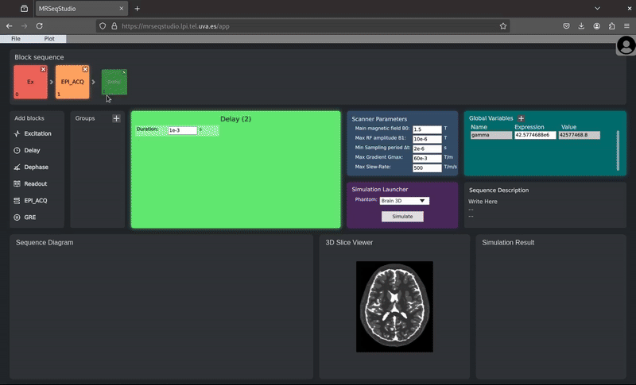

# Web MRI Sequence Editor
Web MRI Sequence Editor and Simulator based on [KomaMRI](https://github.com/JuliaHealth/KomaMRI.jl).


# Guide to deploy the app on your own server
## Requirements
- vcpkg
- CMake
- Qt v6.10
- Emscripten (emsdk) v4.0.7
- Julia v1.12
- Node v22.21 and NPM
- Docker (including `docker compose`)

## Download and Instalation steps
1. Define environment variables:
```bash
  export QT=/path/to/Qt/6.10.0
  export EMSDK=/path/to/emsdk
```

2. Download the repository:
```bash
   git clone https://github.com/pvillacorta/MRSeqStudio
   cd MRSeqStudio
```

3. Configure database credentials and start Docker:
   
   **Important:** You need to set the same MySQL password in both `docker-compose.yml` and `backend/db_config.toml`.
   
   a. Edit `docker-compose.yml` and change `MYSQL_ROOT_PASSWORD: passhere` to your desired password (replace `passhere` in both places).
   
   b. Create the database configuration file:
   ```bash
   cp backend/db_config.example.toml backend/db_config.toml
   ```
   
   c. Edit `backend/db_config.toml` and update:
   - `password = "passhere"` → use the same password you set in `docker-compose.yml`
   - `user = "userhere"` → use `"root"` (the MySQL root user)
   - `database = "dbnamehere"` → use `"MRSeqStudio"` (the database name)
   
   **Note:** The database user and password in `db_config.toml` are the same as the MySQL root credentials defined in `docker-compose.yml` (user: `root`, password: the one you set in `MYSQL_ROOT_PASSWORD`).
   
   d. Start Docker and create the database:
   ```bash
   docker compose up -d
   docker compose exec db mysql -uroot -pYOUR_PASSWORD < MRSeqStudio.sql
   ```
   (Replace `YOUR_PASSWORD` with the password you set in `docker-compose.yml`)

4. Execute the following lines:
```bash
   ./configure.sh
   ./compile.sh
   ./serve.sh
```

5. Open browser and go to 127.0.0.1:8000

## OpenAPI:
The OpenAPI specification document for this API is available [here](https://petstore.swagger.io/?url=https://raw.githubusercontent.com/pvillacorta/MRSeqStudio/refs/heads/master/docs/api.yaml).
